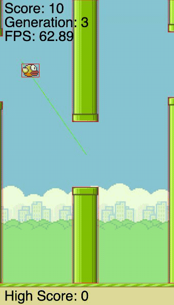

<div align="center">

# Neuroevolution Flappy Bird

A population of small neural networks that teach themselves to play Flappy Bird. There is no training data and no labels. Each generation the best flyers survive, breed, and mutate, and the flock gets better on its own.

Built from scratch in vanilla JavaScript with [p5.js](https://p5js.org/).



**[Play it live](https://jbialecki.com/flappy)** · Press Space to fly it yourself, or hand the controls to the AI.

</div>

## What it does

Two modes on one page:

- **Play it yourself.** Space flaps. Miss a pipe and it is game over.
- **Watch it learn.** Fifty agents fly at once. When the last one crashes, the population breeds a new generation and tries again. A debug overlay shows what each network sees and the decision it makes.

## How the learning works

Each agent is a small feed-forward network with two inputs and one output.

The inputs, both scaled to a 0-1 range:
- the bird's height on the screen
- the vertical center of the next pipe gap

The output is a single number squashed through a sigmoid. Above 0.5, the bird flaps.

There is no backpropagation and no dataset. The networks improve through a genetic algorithm that runs every time the whole population dies:

1. **Score.** Each bird is rated on how far it flew, minus a small penalty for drifting away from the center of the gap.
2. **Select.** Parents are chosen by tournament selection (the best of five random agents), and the single fittest network survives untouched into the next generation (elitism).
3. **Breed and mutate.** Parent weights are mixed by crossover and then nudged at random by mutation to fill out the rest of the population.
4. **Speciate.** Networks with similar weights are grouped into species, and any species that goes ten generations without improving is dropped. This stops one early winner from swamping the whole gene pool.

Speciation and stagnation are borrowed from NEAT. Weights start from a Xavier-style initialization, and the whole loop runs live at 60 fps in the browser.

## Controls

| Action | Control |
| --- | --- |
| Flap (when playing yourself) | Space |
| Switch between playing and watching the AI | Switch Game Mode |
| Toggle the debug overlay (hitboxes, decision lines) | Switch Debug Mode |
| Mute or unmute the music | Toggle Background Music |

## Run it locally

No build step and nothing to install. Clone the repo and serve the folder over http, since the browser blocks loading images and audio from `file://`:

```bash
git clone https://github.com/JackB296/neuroevolution-flappy-bird.git
cd neuroevolution-flappy-bird
python3 -m http.server 8000
```

Then open `http://localhost:8000`.

## Project layout

```
index.html   canvas and control buttons
game.js      game loop, rendering, mode switching, fitness scoring
NEAT.js      the population: selection, speciation, generational turnover
neural.js    the network: predict, crossover, mutate
player.js    the bird: physics and collision
pipe.js      the pipes: spawning and collision
```

## What I would build next

- Frame-rate independent physics, so game speed can be tuned without changing difficulty
- A start screen, plus saving and reloading the best network
- Real topology evolution, growing hidden nodes and new connections, which is the piece that would make this NEAT in full

## License

MIT. See [LICENSE](LICENSE).

Built by Jack Bialecki.
